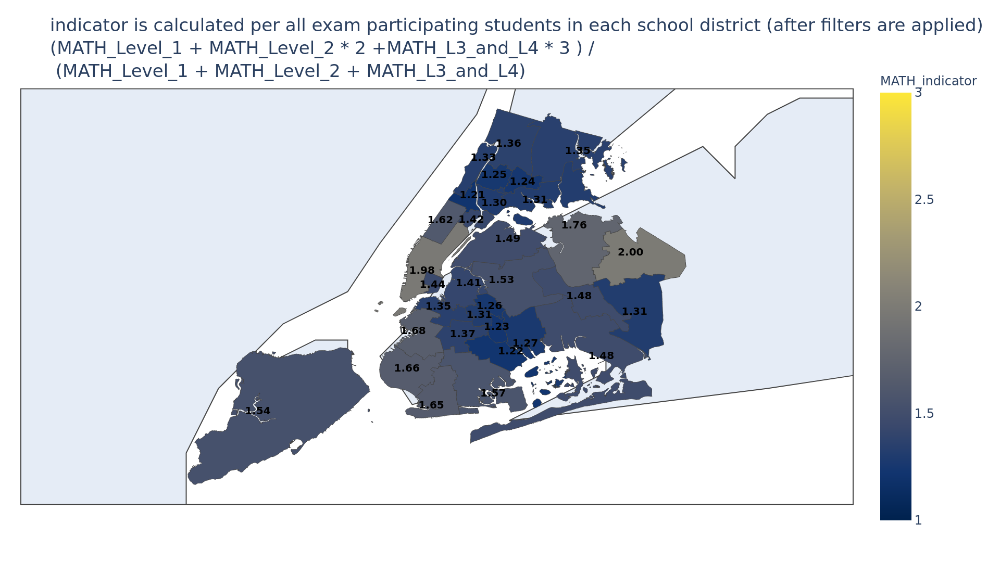

# new-york-students FastAPI demo app

Description:

This app provides API to get data and charts based on provided (or not) filters.


Tested on Python 3.9.5


## A. How to run app:
1. Rename `.env.dev.example` to `.env.dev`. This file contains environmental variables.
2. (Recommended) In `.env.dev` file at least change both `POSTGRES_PASSWORD` and `DB_PASS` to new password (the same password for both variables).
3. Run 
```
docker-compose up --build
```
4. Go to app address:
http://localhost:8080/docs


### Filters description for `/school_entries/` endpoint

`category` is enum, as described in `/docs`, takes one of:
```
'All Students'
'Attend school outside district of residence'
'English Language Learners'
'Poverty'
'Reside in temporary housing'
'Students with Disabilities'
```


The rest of filters takes float between 0.00 and 1.00.


Client doesn't need to send any of them, if not sent app will use default values:

```
{
  "category": "All Students",
  "female_pct_more_than": 0,
  "female_pct_less_than": 1,
  "male_pct_more_than": 0,
  "male_pct_less_than": 1,
  "black_pct_more_than": 0,
  "black_pct_less_than": 1,
  "asian_pct_more_than": 0,
  "asian_pct_less_than": 1,
  "white_pct_more_than": 0,
  "white_pct_less_than": 1,
  "other_pct_more_than": 0,
  "other_pct_less_than": 1
}
```

## B. How to run tests:
1. Create virtual env for this project.
```
python -m venv .venv --prompt coding-challenge
.\.venv\Scripts\python -m pip install -U pip
.\.venv\Scripts\python -m pip install -U wheel
.\.venv\Scripts\pip install -r requirements.txt
.\.venv\Scripts\pip install pytest pytest-docker
source .venv/bin/activate
````
2. Run 
```
pytest -s -v
```


# What can be improved (to-do list):
1. Add unit tests.
2. Change models to use Enum for `category`.
I already changed part of Pydantic `schema`. However when I tried to change SQLAlchemy `models`, pandas didn't want to work properly. So I put this task aside for the time being.
You can see my attempt in branch `switch_type_to_enum`
3. Separate `requirements.txt` for `app` and `celery` microservices.
4. Remove duplicating env vars from .env.dev file 
5. Allow to choose type of exam between MATH and ELA. Currently MATH is hardcoded.
6. Add simple html form interface to choose filters easier (to speed up debugging).
7. Allow to choose result format also as HTML.
8. Change graph to use `mapbox` to have nicer background and colors.


# Details about project decisions

## Gunicorn
I added `gunicorn` in addition to `uvicorn` to make use of multiple CPU cores. 

## POST vs GET
I chose `POST` request type for `/school_entries/` because it creates chart, so it has side effect.


# Blueprint


# Example charts generated by this app:

```
{
  "category": "All Students"
}
```


```
{
  "category": "Students with Disabilities"
}
```



